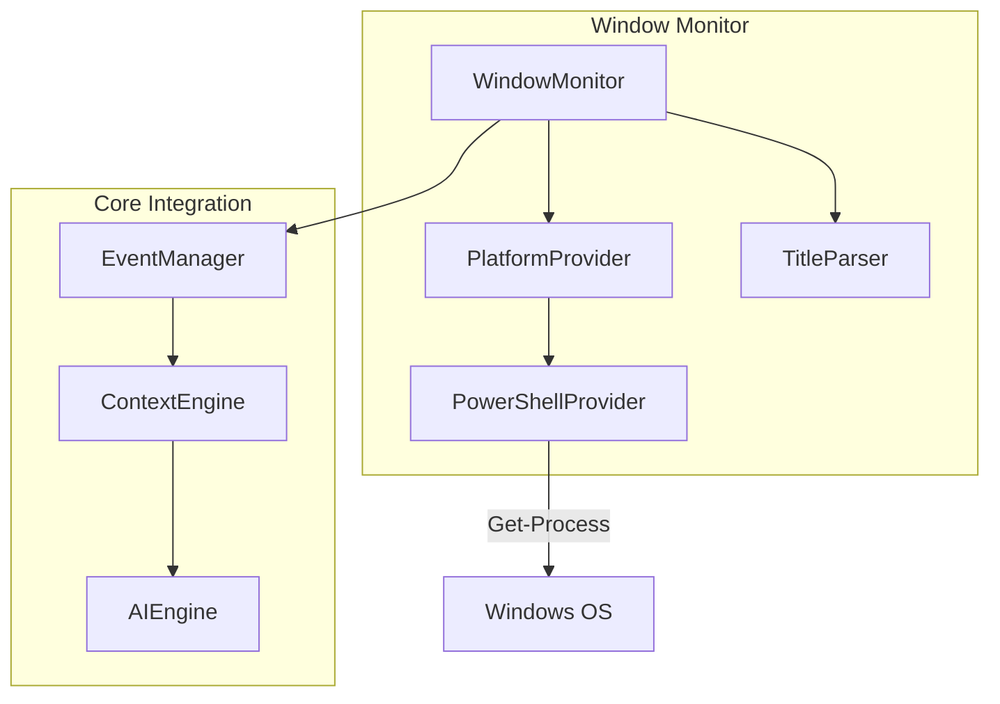

# Design Document: Browser Tab Detection

## Overview

This feature adds the ability for Clippy 2.0 to detect and monitor the active browser tab on Windows systems using PowerShell commands. The Window Monitor component polls the system for the currently focused window, parses the window title to extract browser and page information, and integrates this context with the existing Context Engine to provide more relevant AI assistance.

## Architecture



## Components and Interfaces

### WindowMonitor

The main orchestrator that manages polling and coordinates between platform providers and the event system.

```typescript
interface WindowMonitorConfig {
  pollInterval: number;  // Default: 1000ms
  enabled: boolean;
}

interface WindowInfo {
  title: string;
  processName: string;
  timestamp: number;
}

interface BrowserContext {
  pageTitle: string;
  browserType: 'chrome' | 'firefox' | 'edge' | 'unknown';
  url?: string;  // Not available via window title
  isSupported: boolean;
}

class WindowMonitor {
  constructor(config: WindowMonitorConfig);
  start(): void;
  stop(): void;
  getCurrentWindow(): Promise<WindowInfo | null>;
  onWindowChange(callback: (context: BrowserContext) => void): void;
}
```

### PlatformProvider

Abstract interface for platform-specific window detection implementations.

```typescript
interface PlatformProvider {
  isSupported(): boolean;
  getActiveWindow(): Promise<WindowInfo | null>;
  getPlatformName(): string;
}

class WindowsPowerShellProvider implements PlatformProvider {
  // Uses PowerShell: Get-Process | Where-Object {$_.MainWindowHandle -ne 0}
  // and user32.dll GetForegroundWindow via PowerShell
}
```

### TitleParser

Parses window titles to extract browser type and page title.

```typescript
interface ParsedTitle {
  pageTitle: string;
  browserType: 'chrome' | 'firefox' | 'edge' | 'unknown';
  applicationName: string;
}

class TitleParser {
  parse(windowTitle: string, processName: string): ParsedTitle;
  detectBrowser(windowTitle: string, processName: string): string;
  extractPageTitle(windowTitle: string, browserType: string): string;
}
```

## Data Models

### Window Title Patterns

| Browser | Title Pattern | Example |
|---------|--------------|---------|
| Chrome | `{pageTitle} - Google Chrome` | "GitHub - Google Chrome" |
| Firefox | `{pageTitle} — Mozilla Firefox` | "GitHub — Mozilla Firefox" |
| Edge | `{pageTitle} - Microsoft Edge` | "GitHub - Microsoft Edge" |

### BrowserContext Event

```typescript
interface WindowChangeEvent {
  type: 'window-change';
  data: {
    previous: BrowserContext | null;
    current: BrowserContext;
    timestamp: number;
  };
}
```

## Correctness Properties

*A property is a characteristic or behavior that should hold true across all valid executions of a system-essentially, a formal statement about what the system should do. Properties serve as the bridge between human-readable specifications and machine-verifiable correctness guarantees.*

### Property 1: Title Parsing Preserves Information

*For any* valid browser window title string, parsing the title SHALL extract a non-empty page title and correctly identify the browser type based on the title suffix pattern.

**Validates: Requirements 1.2, 1.3**

### Property 2: Browser Detection Consistency

*For any* window title containing a known browser suffix (Chrome, Firefox, Edge), the browser detection function SHALL return the corresponding browser type. For titles without known suffixes, it SHALL return "unknown".

**Validates: Requirements 2.1, 2.2, 2.3, 2.4**

### Property 3: Event Deduplication

*For any* sequence of window title polls, consecutive polls with identical titles SHALL NOT emit duplicate window change events. Only transitions between different titles SHALL trigger events.

**Validates: Requirements 3.2**

### Property 4: Error Resilience

*For any* error thrown during window detection (PowerShell failure, timeout, etc.), the Window Monitor SHALL catch the error, log it, and continue polling without crashing or stopping the monitor.

**Validates: Requirements 3.3**

### Property 5: Context Integration

*For any* window change event received by the Context Engine, the current context SHALL be updated to include the browser information from the event.

**Validates: Requirements 4.1**

## Error Handling

| Error Scenario | Handling Strategy |
|----------------|-------------------|
| PowerShell execution fails | Log error, return null, continue polling |
| Window title is empty | Return context with empty pageTitle, browserType "unknown" |
| Platform not supported | Disable monitoring, log warning, return isSupported: false |
| Polling timeout | Skip current poll, continue with next interval |

## Testing Strategy

### Unit Testing

- Test TitleParser with various browser title formats
- Test browser detection for Chrome, Firefox, Edge, and unknown browsers
- Test WindowMonitor configuration handling
- Test event emission logic

### Property-Based Testing

Using fast-check library with minimum 100 iterations per property:

1. **Title Parsing Property**: Generate random page titles, construct browser-formatted titles, verify parsing extracts original title
2. **Browser Detection Property**: Generate titles with random browser suffixes, verify correct detection
3. **Deduplication Property**: Generate sequences of window titles with duplicates, verify event count matches unique transitions
4. **Error Resilience Property**: Inject random errors during polling, verify monitor continues operating
5. **Context Integration Property**: Generate window change events, verify context updates correctly

Each property-based test MUST be tagged with: `**Feature: browser-tab-detection, Property {number}: {property_text}**`
