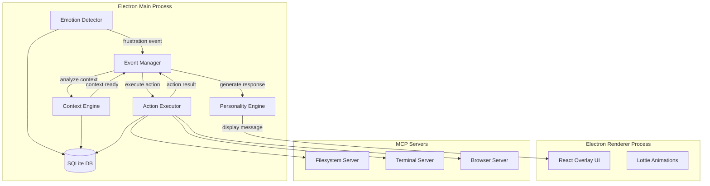
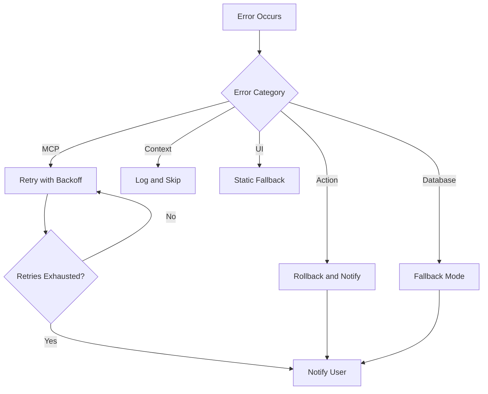

# Design Document

## Overview

Clippy 2.0 is an Electron-based desktop application that resurrects Microsoft's Office Assistant as a genuinely helpful agentic AI. The system uses a modular architecture with four core engines (Emotion Detector, Context Engine, Action Executor, Personality Engine) communicating via an event-driven message bus. The UI renders as a transparent overlay using React with Lottie animations. External integrations are handled through MCP (Model Context Protocol) servers for filesystem, terminal, and browser control. All user data is stored locally in SQLite for privacy.

## Architecture



### Communication Flow

1. **Emotion Detector** monitors system events and user behavior patterns
2. When frustration is detected, it emits an event to the **Event Manager**
3. **Context Engine** captures application state and determines user intent
4. **Action Executor** executes the appropriate action via MCP servers
5. **Personality Engine** generates the response message
6. **Overlay UI** displays Clippy with the message and animations

## Components and Interfaces

### EmotionDetector

```typescript
interface FrustrationSignal {
  type: 'repeated_error' | 'rapid_deletion' | 'idle_after_error' | 'rage_click';
  timestamp: number;
  applicationContext: string;
  severity: number; // 0-1 scale
}

interface EmotionDetector {
  // Start monitoring for frustration signals
  startMonitoring(): void;
  
  // Stop monitoring
  stopMonitoring(): void;
  
  // Register callback for frustration events
  onFrustration(callback: (signal: FrustrationSignal) => void): void;
  
  // Check if user is in flow state
  isInFlowState(): boolean;
  
  // Get current frustration level (0-1)
  getFrustrationLevel(): number;
}
```

### ContextEngine

```typescript
interface TaskContext {
  id: string;
  timestamp: number;
  activeApplication: string;
  windowTitle: string;
  visibleContent: string;
  inferredIntent: TaskCategory;
  confidence: number;
}

type TaskCategory = 
  | 'writing_email'
  | 'debugging_code'
  | 'file_management'
  | 'web_browsing'
  | 'document_editing'
  | 'unknown';

interface ContextEngine {
  // Capture current context snapshot
  captureContext(): Promise<TaskContext>;
  
  // Analyze and infer user intent
  inferIntent(context: TaskContext): Promise<TaskCategory>;
  
  // Check for recurring struggle patterns
  getRecurringPatterns(hours: number): Promise<TaskContext[]>;
  
  // Store context for correlation
  storeContext(context: TaskContext): Promise<void>;
}
```

### ActionExecutor

```typescript
interface ActionRequest {
  id: string;
  type: ActionType;
  parameters: Record<string, unknown>;
  contextId: string;
}

interface ActionResult {
  success: boolean;
  actionId: string;
  output?: unknown;
  error?: string;
  rollbackAvailable: boolean;
}

type ActionType = 
  | 'file_read'
  | 'file_write'
  | 'terminal_execute'
  | 'browser_open'
  | 'generate_text';

interface ActionExecutor {
  // Execute an action with automatic rollback snapshot
  execute(request: ActionRequest): Promise<ActionResult>;
  
  // Rollback a previous action
  rollback(actionId: string): Promise<boolean>;
  
  // Get available actions for a context
  getAvailableActions(context: TaskContext): ActionType[];
  
  // Check MCP server health
  checkServerHealth(server: string): Promise<boolean>;
}
```

### PersonalityEngine

```typescript
interface ClippyMessage {
  id: string;
  text: string;
  animation: AnimationType;
  duration: number;
  actions?: MessageAction[];
}

interface MessageAction {
  label: string;
  callback: () => void;
}

type AnimationType = 
  | 'idle'
  | 'thinking'
  | 'excited'
  | 'apologetic'
  | 'proud'
  | 'wave';

interface PersonalityEngine {
  // Generate a response for an action result
  generateResponse(result: ActionResult, context: TaskContext): ClippyMessage;
  
  // Generate first-time introduction
  generateIntroduction(): ClippyMessage;
  
  // Handle easter egg triggers
  handleEasterEgg(trigger: string): ClippyMessage | null;
  
  // Get personality-appropriate template
  getTemplate(situation: string): string;
}
```

### OverlayUI

```typescript
interface OverlayPosition {
  x: number;
  y: number;
}

interface OverlayState {
  visible: boolean;
  position: OverlayPosition;
  currentAnimation: AnimationType;
  currentMessage: ClippyMessage | null;
}

interface OverlayUI {
  // Show Clippy overlay
  show(): void;
  
  // Hide Clippy overlay
  hide(): void;
  
  // Display a message with animation
  displayMessage(message: ClippyMessage): void;
  
  // Update position (drag handling)
  setPosition(position: OverlayPosition): void;
  
  // Set animation state
  setAnimation(animation: AnimationType): void;
}
```

## Data Models

### Database Schema

```sql
-- Frustration signals log
CREATE TABLE frustration_signals (
  id TEXT PRIMARY KEY,
  type TEXT NOT NULL,
  timestamp INTEGER NOT NULL,
  application_context TEXT,
  severity REAL,
  created_at INTEGER DEFAULT (strftime('%s', 'now'))
);

-- Context snapshots
CREATE TABLE context_snapshots (
  id TEXT PRIMARY KEY,
  timestamp INTEGER NOT NULL,
  active_application TEXT,
  window_title TEXT,
  visible_content TEXT,
  inferred_intent TEXT,
  confidence REAL,
  created_at INTEGER DEFAULT (strftime('%s', 'now'))
);

-- Action history
CREATE TABLE action_history (
  id TEXT PRIMARY KEY,
  context_id TEXT REFERENCES context_snapshots(id),
  action_type TEXT NOT NULL,
  parameters TEXT, -- JSON
  result_success INTEGER,
  result_output TEXT,
  rollback_data TEXT, -- JSON for rollback
  executed_at INTEGER DEFAULT (strftime('%s', 'now'))
);

-- User preferences
CREATE TABLE user_preferences (
  key TEXT PRIMARY KEY,
  value TEXT,
  updated_at INTEGER DEFAULT (strftime('%s', 'now'))
);
```

### TypeScript Types

```typescript
interface StoredFrustrationSignal {
  id: string;
  type: string;
  timestamp: number;
  applicationContext: string;
  severity: number;
  createdAt: number;
}

interface StoredContextSnapshot {
  id: string;
  timestamp: number;
  activeApplication: string;
  windowTitle: string;
  visibleContent: string;
  inferredIntent: string;
  confidence: number;
  createdAt: number;
}

interface StoredActionHistory {
  id: string;
  contextId: string;
  actionType: string;
  parameters: string; // JSON string
  resultSuccess: boolean;
  resultOutput: string;
  rollbackData: string; // JSON string
  executedAt: number;
}
```


## Correctness Properties

*A property is a characteristic or behavior that should hold true across all valid executions of a system-essentially, a formal statement about what the system should do. Properties serve as the bridge between human-readable specifications and machine-verifiable correctness guarantees.*

### Property 1: Repeated Error Frustration Detection

*For any* sequence of error events, if three or more identical errors occur within a 60-second window, the Emotion Detector SHALL classify the user state as frustrated.

**Validates: Requirements 1.1**

### Property 2: Rapid Deletion Frustration Detection

*For any* sequence of text deletion events, if the total deleted characters exceed 50 within a 5-second window, the Emotion Detector SHALL classify the user state as struggling.

**Validates: Requirements 1.2**

### Property 3: Flow State Notification Suppression

*For any* notification generated while the user is in Flow State, the notification SHALL be suppressed unless marked as critical.

**Validates: Requirements 1.3**

### Property 4: Frustration Signal Persistence Round-Trip

*For any* frustration signal that is logged, querying the database by signal ID SHALL return the same signal type, timestamp, and application context that was stored.

**Validates: Requirements 1.5**

### Property 5: Context Capture Completeness

*For any* context capture triggered by frustration, the resulting TaskContext SHALL contain non-empty values for activeApplication, windowTitle, and a valid TaskCategory for inferredIntent.

**Validates: Requirements 2.1, 2.2**

### Property 6: Context Storage Uniqueness

*For any* two context snapshots stored in the database, their IDs SHALL be distinct.

**Validates: Requirements 2.3**

### Property 7: Recurring Pattern Detection

*For any* set of context snapshots where three or more share the same inferred intent within 24 hours, the Context Engine SHALL flag this as a recurring struggle pattern.

**Validates: Requirements 2.4**

### Property 8: Action Rollback Availability

*For any* action executed by the Action Executor, a rollback snapshot SHALL be created before execution, and rollback SHALL be possible if the action fails.

**Validates: Requirements 3.2, 3.4**

### Property 9: Action Result Notification

*For any* completed action (success or failure), the system SHALL generate a ClippyMessage containing the action outcome summary.

**Validates: Requirements 3.3, 3.4**

### Property 10: Easter Egg Trigger Detection

*For any* user input string containing both "hate" (case-insensitive) and "Clippy" (case-insensitive), the Personality Engine SHALL return a non-null easter egg response.

**Validates: Requirements 4.2**

### Property 11: Position Persistence Round-Trip

*For any* overlay position set by the user, storing and then retrieving the position SHALL return coordinates equal to the original position.

**Validates: Requirements 5.3**

### Property 12: File Read Integrity

*For any* file read operation via the filesystem MCP Server, the returned content SHALL match the actual file content with correct encoding.

**Validates: Requirements 6.1**

### Property 13: File Write Backup Creation

*For any* file write operation via the filesystem MCP Server, a backup of the original file SHALL exist before the write completes.

**Validates: Requirements 6.2**

### Property 14: Terminal Output Capture

*For any* terminal command execution, the result SHALL contain both stdout and stderr streams from the executed command.

**Validates: Requirements 6.3**

### Property 15: MCP Operation Timeout

*For any* MCP Server operation that exceeds 30 seconds, the operation SHALL be terminated and return a timeout error.

**Validates: Requirements 6.5**

### Property 16: Interaction History Completeness

*For any* stored interaction, the database record SHALL contain timestamp, context reference, action type, and outcome fields.

**Validates: Requirements 7.2**

### Property 17: Data Deletion Completeness

*For any* data deletion request, querying the database after deletion SHALL return zero records for the deleted user's data.

**Validates: Requirements 7.4**

## Error Handling

### Error Categories

| Category | Examples | Handling Strategy |
|----------|----------|-------------------|
| MCP Server Errors | Connection failed, timeout | Retry with exponential backoff, notify user after 3 failures |
| Context Capture Errors | No active window, permission denied | Log error, skip context capture, continue monitoring |
| Action Execution Errors | File not found, command failed | Automatic rollback, display error with recovery options |
| Database Errors | Disk full, corruption | Graceful degradation, in-memory fallback, alert user |
| UI Rendering Errors | Animation load failed | Fallback to static image, log for debugging |

### Error Response Flow



### Rollback Strategy

1. Before any destructive action, serialize current state to `rollback_data` JSON
2. Execute action within try-catch block
3. On failure: deserialize rollback data and restore previous state
4. On success: keep rollback data for manual undo (24-hour retention)

## Testing Strategy

### Unit Testing

Unit tests will cover individual component logic using Jest:

- **EmotionDetector**: Test threshold calculations, signal classification
- **ContextEngine**: Test intent inference, pattern matching
- **ActionExecutor**: Test action routing, rollback mechanics
- **PersonalityEngine**: Test template selection, easter egg detection
- **Database operations**: Test CRUD operations, query correctness

### Property-Based Testing

Property-based tests will use **fast-check** library to verify correctness properties:

- Each property from the Correctness Properties section will have a corresponding PBT
- Tests will run minimum 100 iterations per property
- Each test will be tagged with: `**Feature: clippy-mvp, Property {number}: {property_text}**`

### Integration Testing

- End-to-end flow from frustration detection to action execution
- MCP server communication tests
- Electron main/renderer process communication

### Test File Structure

```
src/
├── core/
│   ├── emotion-detector.ts
│   ├── emotion-detector.test.ts      # Unit tests
│   ├── emotion-detector.property.ts  # Property tests
│   ├── context-engine.ts
│   ├── context-engine.test.ts
│   ├── context-engine.property.ts
│   └── ...
├── mcp-servers/
│   ├── filesystem/
│   │   ├── index.ts
│   │   ├── index.test.ts
│   │   └── index.property.ts
│   └── ...
```
